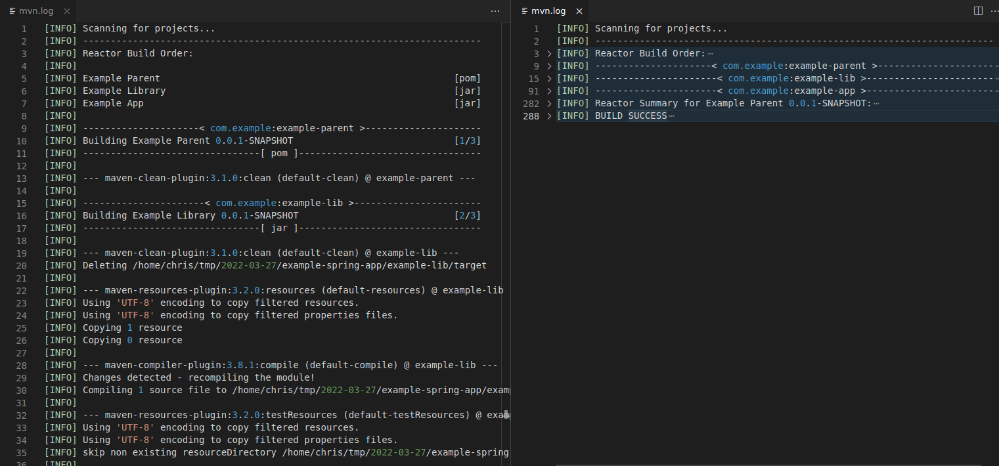
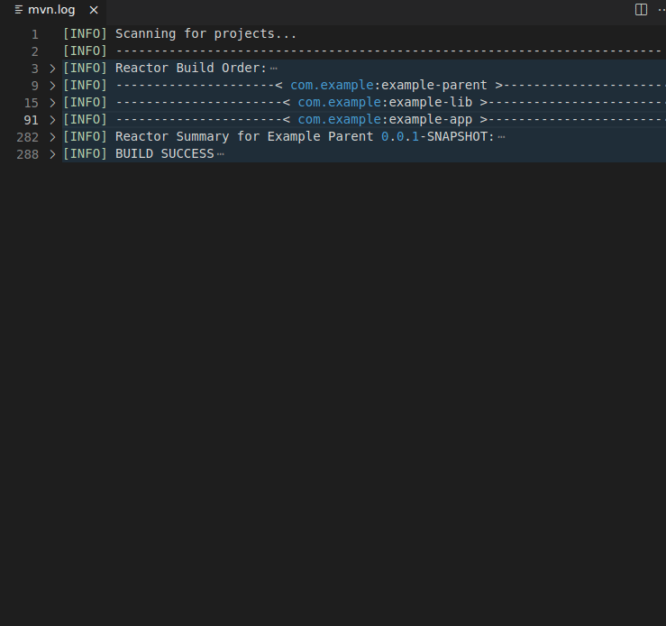

# Maven Log Folding

Add folding ranges to Maven log files.

## Summary

Adds folding regions to maven log files.

*A maven log file without folding compared to the same log file with all regions folded:*

*Folding and unfolding Maven log file examples:*

## Features

- Top level of folding is each Maven project, as well as the Maven reactor build order, summary, and status
- Second level of folding is each plugin that runs
- Third level of folding is each test class run
- Fold groups of "downloading..."/"downloaded..." (and related) lines
- Fold groups of lines that start with "[DEBUG]"
- Fold groups of lines that start with "[ERROR]"
- Fold groups of lines that do not start with any log level ("[INFO]", "[DEBUG]", etc)
 

## Settings

`maven-log-folding-and-colors.filePatterns` - Array of Glob patterns that match the absolute path of documents to apply Maven Log Folding to.  Default: `[ "**/mvn*.log", "**/maven*.log" ]`

`maven-log-folding-and-colors.linePrefixPattern` - RegEx pattern for non-Maven output that might at the beginning of each line.  This can be used for build system logs that prefix each line of Maven output with information like a date.  Default: `""`
- NOTE: all groups (parenthesis) in regex should be non-capturing groups (ex: `(?:a|b)` )

## Known Issues

This extension uses expected patterns to add folding to a Maven log file.  The Maven output could change at any time, which may not match these expected patterns and cause this extension to not work as intended.

I consider this extension experimental at this time, as it has not yet been tested against the many different version of Maven nor against many different Maven project setups.  With the wide variety of Maven versions available and numerous different ways to setup and run a Maven project, any of these may not work as expected with this extension.  If you come across a scenario that does not work correctly, please open an issue and/or a PR to improve this extension.

### Downloading Artifacts Log Lines Behavior

Since Maven can download artifacts in parallel, it is impossible to fold these lines perfectly such that all the lines regarding the downloading of a specific artifact are always in the same folding region.

## Future Enhancements

Future enhancements under consideration include:

- Colorizing log (similar to command line)
