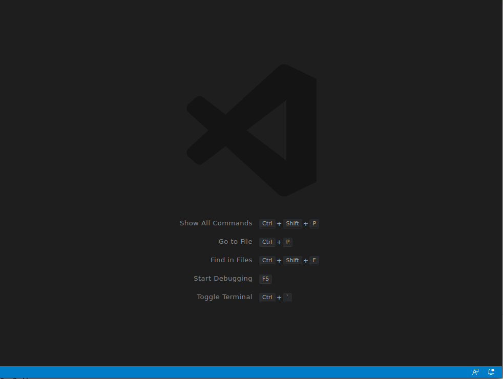

# Maven Log Folding

Add folding ranges to Maven log files.

## Summary

Adds folding regions to maven log files.

## Features

- Top level of folding is each Maven project, as well as the Maven reactor build order, summary, and status
- Second level of folding is each plugin that runs
- Third level of folding is each test class run
- Additional folding regions cover consecutive "downloading..."/"downloaded..." lines

## Settings

`maven-log-folding-and-colors.filePatterns` - Array of Glob patterns that match the absolute path of documents to apply Maven Log Folding to.  Defaults to `[ "**/mvn*.log", "**/maven*.log" ]`

## Known Issues

This extension uses expected patterns to add folding to a Maven log file.  The Maven output could change at any time, which may not match these expected patterns and cause this extension to not work as intended.

I consider this extension experimental at this time, as it has not yet been tested against the many different version of Maven nor against many different Maven project setups.  With the wide variety of Maven versions available and numerous different ways to setup and run a Maven project, any of these may not work as expected with this extension.  If you come across a scenario that does not work correctly, please open an issue and/or a PR to improve this extension.

## Future Enhancements

Future enhancements under consideration include:

- Folding consecutive lines of Maven debug-level output (from when Maven debugging is enabled)
- Folding stack traces (typically seen in test output)
- Colorizing log (similar to command line)
